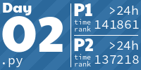
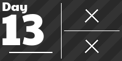
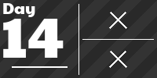

# advent-of-code
All Advent of Code problems which I have attempted

<!-- AOC TILES BEGIN -->
<h1 align="center">
  2025 - 18 ⭐ - Python
</h1>

<h1 align="center">
  2024 - 50 ⭐ - Python
</h1>

<h1 align="center">
  2023 - 28 ⭐ - Python
</h1>

<h1 align="center">
  2022 - 30 ⭐ - Python
</h1>

<h1 align="center">
  2021 - 33 ⭐ - Python
</h1>

<h1 align="center">
  2020 - 16 ⭐ - 
</h1>

<h1 align="center">
  2019 - 10 ⭐ - Python
</h1>

<!-- AOC TILES END -->
